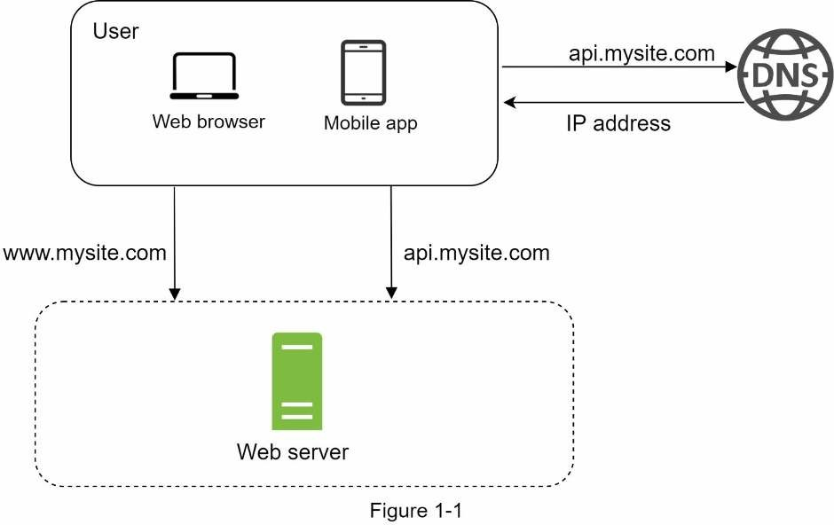
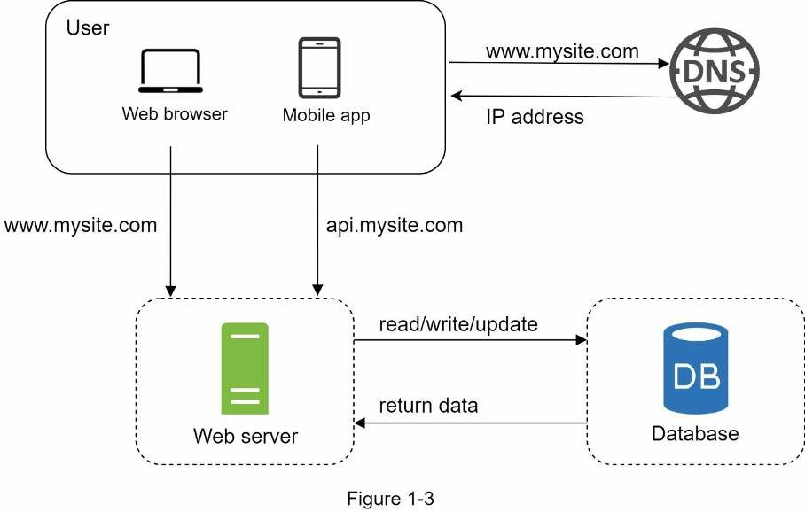
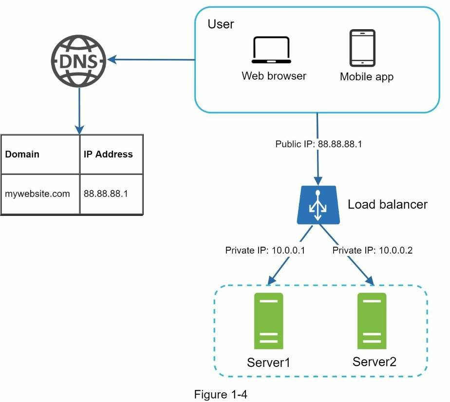
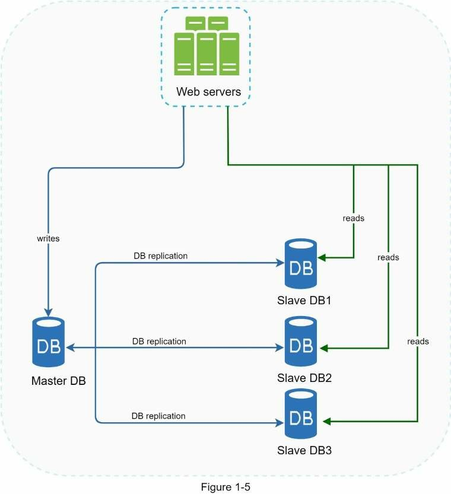
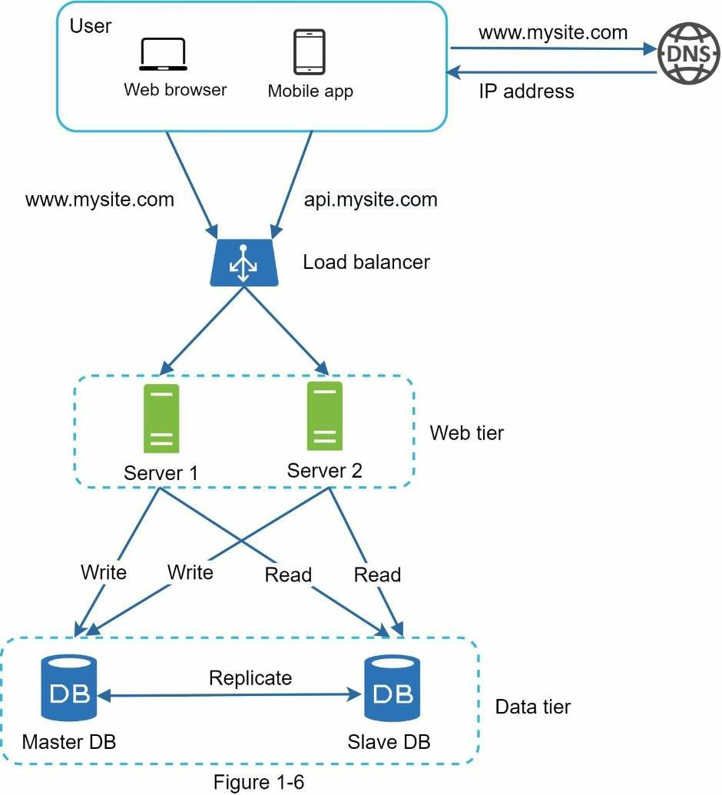

# Chapter 1: Thiết Kế Hệ Thống Cho Hàng Triệu Người Dùng

*Thiết kế hệ thống hỗ trợ hàng triệu người dùng là một thử thách không nhỏ, nó đòi hỏi sự cải tiến liên tục và không ngừng. Trong chương này, ta sẽ xây dựng một hệ thống hỗ trợ người dùng duy nhất và dần dần mở rộng cho hàng triệu người dùng. Sau chương này, bạn sẽ nắm vững các kỹ thuật để vượt qua bài phỏng vấn thiết kế hệ thống.*

## Thiết lập hệ thống đơn

Hành trình vạn dặm nào cũng bắt đầu từ những bước đi đầu tiên, và thiết kế hệ thống cũng vậy. Khi bắt đầu, ta sẽ chạy tất cả mọi thứ trên một server duy nhất. Hình bên dưới minh hoạ việc thiết lập một server để chạy tất cả mọi thứ trên đó: ứng dụng web, cơ sở dữ liệu, cache,...



Để hiểu thiết lập này, sẽ hữu ích khi khám phá luồng yêu cầu là nguồn lưu lượng truy cập. Trước tiên ta sẽ xem luồng yêu cầu.


1. Người dùng truy cập vào website thông qua tên miền, vd như api.mysite.com. Tên miền của trang web được cung cấp từ DNS, DNS (Domain Name System) là dịch vụ trả phí bên thứ 3 giúp cung cấp tên miền và không được lưu trữ trên server của ta.
2. Địa chỉ Internet Protocol (IP) được trả về từ trình duyệt hoặc ứng dụng di động. Trong ví dụ: địa chỉ IP được trả về là 15.125.23.214.
3. Sau khi có được địa chỉ IP, Giao thức truyền tải siêu văn bản (HTTP) sẽ được gửi trực tiếp đến web server của bạn.
4. Web server trả về trang HTML hoặc JSON trong trích xuất phản hồi.

Bây giờ, ta sẽ xem xét nguồn lưu lượng truy cập. Lưu lượng truy cập web server đến từ hai nguồn là: ứng dụng web và ứng dụng di động.

- Ứng dụng web: nó kết hợp các ngôn ngữ server-side (Java, Python,...) để xử lý các logic nghiệp vụ, lưu trữ,.. và ngôn ngữ client-side (HTML, JS) cho biểu diễn ứng dụng.
- Ứng dụng di động: Giao thức HTTP là giao thức giao tiếp giữa ứng dụng di động và web server. JSON được dùng phổ biến cho định dạng API phản hồi để chuyển đổi dữ liệu một cách đơn giản. Ví dụ phản hồi JSON có dạng như sau:


## Cơ sở dữ liệu

Khi lượng người dùng dần tăng lên, một server là không đủ, ta cần nhiều hơn: một server cho truy cập từ web/mobile, và một server khác cho cơ sở dữ liệu. Tách biệt server truy cập (web tier) và server cơ sở dữ liệu (data tier) cho phép chúng mở rộng một cách độc lập.



### Chọn cơ sở dữ liệu ?

Bạn có thể chọn giữa loại SQL truyền thống hoặc NoSQL. Ta sẽ xem xét sự khác biệt giữa chúng.

Cơ sở dữ liệu quan hệ (SQL) còn được gọi là RDBMS (Relational database management system). Ta có các cái tên phổ biến như MySQL, Oracle, PostgreSQL,... SQL biểu diễn và lưu trữ dữ liệu trong các bảng và hàng. Bạn có thể thực hiện thao tác *join* giữa các bảng khác nhau trong SQL.

Cơ sở dữ liệu phi quan hệ (NoSQL) có các tên phổ biến như MongoDB, Cassandra, Neo4j, Redis,...Có 4 loại cơ sở dữ liệu phi quan hệ là: dạng key-value, hướng tài liệu (document), hướng cột (column) và hướng đồ thị (graph). Thao tác join không được hỗ trợ trong NoSQL.

Với hầu hết dev, SQL là lưu chọn tốt hơn bởi vì nó đã hơn 40 năm phát triển, nó có nhiều tài liệu và cộng đồng lớn mạnh. Tuy nhiên, trong các trường hợp đặc biệt ta có thể chọn NoSQL thay thế. Vd như:
- Ứng dụng yêu cầu độ trễ rất thấp
- Dữ liệu phi cấu trúc hoặc không có quan hệ với nhau.
- Bạn chỉ cần serialize và deserialize dữ liệu (JSON, XML,...) 
- Bạn cần lưu trữ một lượng khổng lồ dữ liệu.

## Mở rộng theo chiều dọc và theo chiều ngang

Mở rộng theo chiều dọc ám chỉ đến "scale-up"(làm cho hệ thống lớn hơn), nghĩa là quá trình thêm các phần cứng (CPU, RAM, ...) vào server của bạn. Mở rộng theo chiều ngang, ám chỉ đến "scale-out"(thêm thành phần vào hệ thống), cho phép ta thêm nhiều hơn một server vào nguồn tài nguyên của bạn.

Khi lưu lượng truy cập thấp, mở rộng theo chiều dọc là giải pháp tuyệt vời vì nó đơn giản hoá vấn đề. Thật không may, nó đi kèm với những hạn chế nghiêm trọng:
- Mở rộng theo chiều dọc có giới hạn vì ta không thể thêm vô hạn CPU và bộ nhớ vào một server
- Mở rộng theo chiều dọc không có chuyển đổi tự động và dự phòng. Nếu server sập thì cả ứng dụng và web sẽ sập hoàn toàn.

Mở rộng theo chiều ngang phù hợp hơn với mở rộng ứng dụng quy mô lớn so với mở rộng theo chiều dọc.

Trong thiết kế trước, người dùng được kết nối trực tiếp với web server. Người dùng sẽ không thể truy cập trang web nếu server ngoại tuyến. Trong trường hợp khác, nếu nhiều người dùng truy cập web server đồng thời khiến server trở nên quá tải, dẫn đến phản hồi người dùng chập hoặc không thể kết nối được server. Lúc này, cân bằng tải là một kỹ thuật tốt nhất để giải quyết vấn đề này.

## Bộ cân bằng tải

Bộ cân bằng tải (Load Balancer) phân phối đồng đều lưu lượng truy cập đến giữa các web server được xác định trong bộ cân bằng tải. Xem hình cách hoạt động của bộ cân bằng tải:



Như hình trên, người dùng kết nối trực tiếp với địa chỉ IP công khai của bộ cân bằng tải. Với thiết lập trên, web server không thể tiếp cận trực tiếp bởi client. Để bảo mật tốt hơn, IP riêng tư được dùng để giao tiếp giữa các server. Một IP riêng tư là một IP có thể tiếp cận giữa các server trong cùng mạng những không thể tiếp cận từ internet bên ngoài. Bộ cân bằng tải giao tiếp với các web server thông qua IP riêng tư.

Ở hình trên, sau bộ cân bằng tải là hai web server, như vậy là ta đã giải quyết được vấn đề chuyển đổi tự động và cải thiện tính khả dụng của web. Chi tiết được giải thích bên dưới:
- Nếu server 1 ngoại tính, truy cập sẽ được chuyển sang server 2. Điều này ngăn chặn việc website sập. Ta cũng sẽ thêm một web server khoẻ manh mới vào để cân bằng tải.
- Nếu lưu lượng truy cập web tăng mạnh, hai server là không đủ để xử lý, bộ cân bằng tải có thể xử lý vấn đề này một cách gọn gàng. Bạn chỉ cần thêm server vào nhóm web server bộ cận bằng tải sẽ tự đổi gửi yêu cầu đến nó.

Bây giờ ở web tier đã ổn vậy còn data tier. Thiết kế hiện tại chỉ có một cơ sở dữ liệu, và nó không hỗ trợ cho chuyển đổi tự động và dự phòng. Bản sao cơ sở dữ liệu là một kỹ thuật chung cho giải quyết vấn đề này. 

## Bản sao cơ sở dữ liệu

Từ Wikipedia: "Bản sao cơ sở dữ liệu có thể được dụng trong hệ thống quản lý nhiều cơ sở dữ liệu, thông thường mối quan hệ master/slave giữa bản gốc (master) và bản copy (slave)*

Cơ sở dữ liệu master chỉ hỗ trợ thao tác ghi. Còn các cơ sở dữ liệu slave lấy dữ liệu sao chép từ cơ sở dữ liệu master và chỉ cung cấp thao tác đọc. Tất cả lệnh chỉnh sửa dữ liệu như INSERT, DELETE và UPDATE sẽ được gửi vào cơ sở dữ liệu master. Phần lớn ứng dụng đều yêu cầu truy cập đọc nhiều hơn ghi, do đó số lượng cơ sở dữ liệu slave trong hệ thống nhiều hơn cơ sở dữ liệu master. 



Lợi thế của bản sao cơ sở dữ liệu.
- Hiệu suất tốt hơn: trong mô hình master-slave, mọi thao tác ghi và cập nhật xảy ra ở master, trong khi đó, thao tác đọc được phân phối trên toàn bộ slave. Mô hình này giúp cải thiện hiệu suất vì cho phép các truy vấn được xử lý song song.
- Độ tin cậy: Nếu một trong số cơ sở dữ liệu bị huỷ bởi các thiên tai như bão, lũ động đất, dữ liệu vẫn có thể phục hồi. Bạn sẽ không cần lo lắng về mất dữ liệu vì nó được sao chép trên nhiều vị trí.
- Tính khả dụng cao: Vì dữ liệu được sao chép trên nhiều nơi, website của bạn vẫn hoạt động nếu một cơ sở dữ liệu ngoại tuyến vì bạn có thể truy cập vào cơ sở dữ liệu khác.

Ở phần trước, ta đã thảo luận về bộ cân bằng tải giúp cải thiện hiệu suất thế nào. Bây giờ ta sẽ có câu hỏi tương tự: "Nếu một cơ sở dữ liệu ngoại tuyến ?" Kiến trúc ở trên có thể xử lý trường hợp này không:
- Nếu chỉ có một cơ sở dữ liệu slave khả dụng và nó trở nên ngoại tuyến, thì tạm thời các thao tác đọc sẽ hướng tới cơ sở dữ liệu master. Ngay sau khi vấn đề được phát hiện, cơ sở dữ liệu slave mới thay thế cho cái cũ. Trong trường hợp nhiều cơ sở dữ liệu slave khả dụng, thao tác đọc sẽ được điều hướng sang các cơ sở dữ liệu này. Một server cơ sở dữ liệu mới sẽ thay thế cái cũ.
- Nếu cơ sở dữ liệu master ngoại tuyến, một cơ sơ dữ liệu slave sẽ được thăng chức lên là master. Tạm thời tất cả thao tác đến cơ sở dữ liệu sẽ được thực thi trên master mới. Một cơ sở dữ liệu slave mới sẽ sao chép dữ liệu ngay lập tức. Thực tế thì việc thăng cấp lên master mới sẽ phức tạp hơn vì dữ liệu trong slave có thể không được cập nhật. Dữ liệu bị thiếu cần được cập nhật bằng cách chạy các tập lệnh khôi phục dữ liệu. Mặc dù một số phương pháp sao chép như multi-master và sao chép vòng tròn có thể hữu ích, nhưng những thiết lập đó phức tạp hơn, và các cuộc thảo luận về điều đó nằm ngoài phạm vi bài viết này. Bạn có thể tham khảo ở danh mục tư liệu tham khảo.

Hình bên dưới hiển thị cách thêm bộ cân bằng tải vào bản sao cơ sở dữ liệu.



Từ hình trên ta có thể thấy:
- Một người dùng lấy địa chỉ IP của bộ cân bằng tải từ DNS.
- Người dùng kết nối với bộ cân bằng tải từ địa chỉ IP này.
- HTTP yêu cầu chuyển hướng đến Server 1 hoặc Server 2.
- Web server đọc dữ liệu người dùng từ cơ sở dữ liệu slave.
- Web server hướng bất kỳ thao tác chỉnh sửa dữ liệu nào đến cơ sở dữ liệu master. Các thao tác này có thể là thêm, sửa và xoá.

Bây giờ, bạn đã hiểu rõ về cả tier web và data, đã đến lúc cải thiện thời gian load/response. Điều này có thể được thực hiện bằng cách thêm một lớp bộ nhớ cache và chuyển nội dung tĩnh (file JavaScript / CSS / hình ảnh / video) sang CDN.

## Cache

Cache là nơi lưu trữ tạm thời để lưu trữ kết quả của phản hồi được truy cập thường xuyên trong bộ nhớ dữ liệu để các yêu cầu tiếp theo được phản hồi nhanh hơn. Như ở hình 1-6, mỗi lần trang web tải lại, một hoặc nhiều cơ sở dữ liệu được gọi để tìm nạp dữ liệu. Hiệu suất ứng dụng có thể bị ảnh hưởng này bởi các lệnh gọi trùng lặp này. Cache có thể giải quyết vấn đề trên.

### Cache tier

Cache tier là lớp lưu trữ dữ liệu tạm thời, nhanh hơn cơ sở dữ liệu. Lợi ích của một cache tier riêng biệt là cải thiện hiệu suất hệ thống, giảm tải cho cơ sở dữ liệu và có thể mở rộng cache độc lập. Hình bên dưới mô tả thiết lập một cache server:


Sau khi nhận yêu cầu, web server kiểm tra nếu cache là khả dụng cho phản hồi. Nếu cache có, gửi dữ liệu về lại cho client. Còn không, truy vấn đến cơ sở dữ liệu và lưu phản hồi vào cache rồi gửi về client. Chiến lược caching này được gọi là read-through cache. 

Tương tác với server cache rất đơn giản vì hầu hết các server cache đều cung cấp các APIs cho hầu hết ngôn ngữ lập chình. Đoạn code sau minh hoạ Memcached APIs:

```js
SECONDS = 1
cache.set('myKey', 'hi there', 3600 * SECONDS)
cache.get('myKey)
```