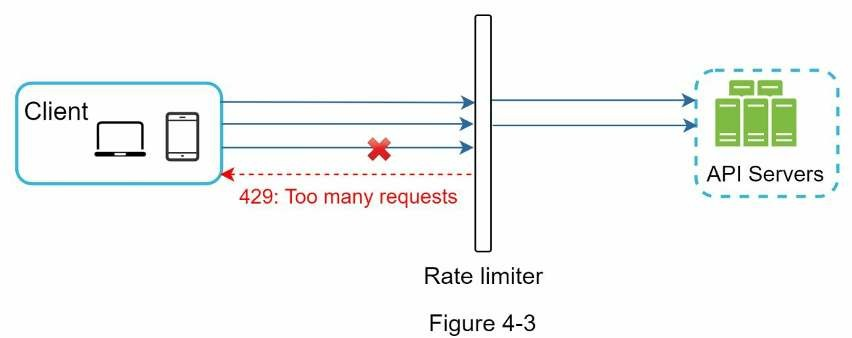
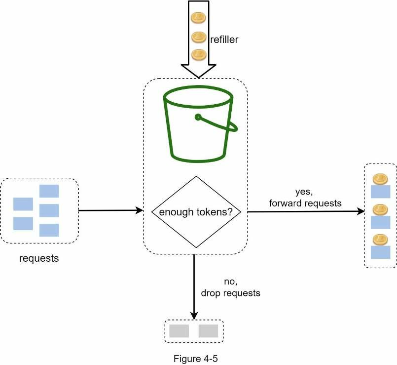

# Thiết Kế Bộ Giới Hạn Truy Cập

Trong một hệ thống mạng, bộ giới hạn truy cập (rate limiter) là công cụ cho điều khiển lưu lượng truy cập được gửi đến bởi client hay một dịch vụ nào đó. Trong HTTP, bộ giới hạn truy cập sẽ giới hạn số lượng yêu cầu client được cho phép gửi trong một khoảng thời gian cụ thể. Nếu số lượng yêu cầu API vượt quá ngưỡng cho phép bởi bộ giới hạn, tất cả các lệnh gọi tiếp theo sẽ bị chặn. Ví dụ:
- Một người viết không thể viết hai bài một giây.
- Chỉ có thể tạo 10 tài khoản từ một địa chỉ IP.
- Chỉ có thể nhận thưởng 5 lần trên một tuần từ một thiết bị.

Trong bài hôm nay, ta sẽ trả lời câu hỏi thiết kế một bộ giới hạn truy cập. Trước tiên, ta sẽ xem qua các lợi ích khi sử dụng nó:
- Ngăn chặn cạn kiệt tài nguyên bởi tấn công DoS(Denial of Service) [1]. Hầu hết API công khai bởi các công ty lớn đều thực thi các kiểu giới hạn truy cập. Ví dụ, Twitter giới hạn số lượng tweet là 300 trong 3 giờ [2]. Google Docs giới hạn 300 người dùng trên 60 giây cho một lần yêu cầu đọc[3]. Một bộ giới hạn truy cập sẽ ngăn chặn các cuộc tấn công DoS, dù vô tình hay cố ý, bằng cách chặn các lệnh gọi vượt ngưỡng.
- Giảm chí phí. Việc giới hạn các yêu cầu vượt ngưỡng đồng nghĩa với ít server hơn và ít cấp phát tài nguyên hơn. Giới hạn truy cập là rất quan trọng với các công ty sử dụng API trả phí bên thứ 3. Ví dụ bạn bị tính phí cơ sở cho mỗi lần gọi cho các API bên ngoài như: kiểm tra tín dụng, thanh toán, truy xuất hồ sơ sức khỏe, ... Hạn chế số lượng yêu cầu là điều cần thiết để giảm chi phí.
- Ngăn chặn server bị sập. Để giảm tải cho server, bộ giới hạn được dùng để lọc các yêu cầu vượt ngưỡng gây ra bởi bot hoặc hành vi phá hoại từ người dùng.

## 1. Hiểu vấn đề và thiết lập phạm vi của thiết kế

Giới hạn truy cập có thể thực hiện bằng cách triển khai các thuật toán khác nhau, mỗi cái sẽ có ưu nhược riêng. Việc tương tác với người phỏng vấn sẽ giúp ứng viên hiểu rõ kiểu và phạm vi của bộ giới hạn mà họ cần xây dựng.

- **Ứng viên**: Kiểu triển khai của bộ giới hạn truy cập mà ta cần là gì? Nó sẽ là client-side hay server-side?
- **Người phỏng vấn**: Câu hỏi tốt đấy. Ta sẽ tập trung vào server-side.

- **Ứng viên**: Bộ giới hạn sẽ điều tiết yêu cầu dựa trên địa chỉ IP, ID người dùng hay một thuộc tính nào khác?
- **Người phỏng vấn**: Nó phải đủ linh hoạt để hỗ trợ các quy tắc điều tiết khác nhau.

- **Ứng viên**: Hệ thống của nó lớn cỡ nào? Một công ty startup hay một công ty lớn với đông đảo người dùng?
- **Người phỏng vấn**: Hệ phống phải xử lý một lượng lớn người dùng.

- **Ứng viên**: Hệ thống sẽ hoạt động trong môi trường phân tán?
- **Người phỏng vấn**: Đúng vậy.

- **Ứng viên**: Bộ giới hạn sẽ là một dịch vụ riêng biệt hay là được triển khai trong ứng dụng?
- **Người phỏng vấn**: Tuỳ bạn quyết định.

- **Ứng viên**: Ta có cần thông báo cho người dùng bị chặn (điều tiết) hay không?
- **Người phỏng vấn**: Dĩ nhiên.

Như vậy ta có các yêu cầu sau:
- Giới hạn chính xác các yêu cầu vượt ngưỡng.
- Độ trễ thấp. Bộ giới hạn truy cập không nên chậm hơn thời gian phản hồi HTTP.
- Sử dụng bộ nhớ ít nhất có thể.
- Có thể chia sẻ trên nhiều server hay tiến trình.
- Xử lý ngoại lệ. Hiển thị dọn dẹp ngoại lệ cho người dùng yêu cầu của họ bị điều tiết.
- Khả năng chịu lỗi cao. Bất kỳ sự cố nào với bộ giới hạn truy cập sẽ không ảnh hưởng đến toàn hệ thống.

## 2. Đề xuất thiết kế

**Nơi đặt bộ giới hạn truy cập?**

Ta có thể triển khai bộ giới hạn bằng cả server-side và client-side:
* Client-side: nhìn chung thì client là nơi không đáng tin cậy để thực thi bộ giới hạn truy cập, bởi vì các yêu cầu client có thể dễ dàng bị giả mạo bởi các tác nhân độc hại. Hơn nữa ta cũng không có quyền kiểm soát khi triển khai ở client.
* Server-side: Hình bên dưới cho ta thấy bộ giới hạn truy cập được đặt ở server-side.

Bên cạnh đó ta cũng có một cách khác là đặt bộ giới hạn truy cập ở server API, để nó hoạt động giống như một middleware, thực hiện điều tiết yêu cầu đến API của bạn như hình bên dưới.

Giả sử API của ta cho phép 2 yêu cầu trên một giây, và client gửi 3 yêu cầu đến server trong một giây. Hai yêu cầu đầu tiên được định tuyến đến server. Nhưng yêu cầu thứ ba bị bộ giới hạn chặn lại và trả về HTTP Status code 429. Phản hồi HTTP 429 biểu hiện một người dùng gửi quá nhiều yêu cầu.

Các microservices [4] đang trở nên phổ biến và bộ giới hạn truy cập thường được dùng cho triển khai trong API gateway. API gateway là dịch vụ quản lý hoàn toàn hỗ trợ giới hạn truy cập, chứng chỉ SSL, xác thực, IP được cho phép,... Bây giờ ta đã biệt API gateway là một dịch vụ hỗ trợ giới hạn truy cập.

Khi thiết kế bộ giới hạn truy cập, câu hỏi quan trọng nhất cần trả lời là: "Đâu là nơi bộ giới hạn nên triển khai, ở server-side hay là trong gateway". Không có một câu trả lời hoàn chỉnh, nó tuỳ thuộc vào công ty mà bạn đang làm việc, các công nghệ hiện tại, nguồn tài nguyên, độ ưu tiên của mục tiên,... Ở đây ta có vài hướng dẫn phổ biến.
- Đánh giá công nghệ hiện tại của bạn, chẳng hạn như ngôn ngữ lập trình, cache,... Đảm bảo rằng ngôn ngữ lập trình hiện tại của bạn hiệu quả để thực hiện giới hạn truy cập ở phía server.
- Xác định thuật toán giới hạn truy cập phù hợp với nhu cầu doanh nghiệp. Khi bạn triển khai mọi thứ ở phía server, bạn có toàn quyền kiểm soát thuật toán. Tuy nhiên, sự lựa chọn có thể bị hạn chế nếu bạn dùng gateway bên thứ 3.
- Nếu bạn sử dụng kiến trúc microservice bao gồm các API gateway trong thiết kế để thực hiện xác thức, lập danh sách IP cho phép,... bạn có thể thêm bộ giới hạn truy cập vào API gateway.
- Việc xây dựng dịch vụ giới hạn truy cập của riêng bạn mất nhiều thời gian. Nếu bạn không có đủ tài nguyên để triển khai bộ giới hạn truy cập, thì API gateway thương mại là một lựa chọn tốt hơn.

### Thuật toán cho giới hạn truy cập

Giới hạn truy cập có thể thực hiện bằng cách triển khai các thuật toán khác nhau, mỗi cái sẽ có ưu nhược riêng. Mặc dù ở bài viết này không tập trung vào các thuật toán, nhưng việc hiểu chúng sẽ giúp chọn đúng thuật toán hoặc kết hợp các thuật toán để phù hợp với các trường hợp sử dụng của chúng ta. Dưới đây là danh sách các thuật toán phổ biến:
* Token bucket
* Leaking bucket
* Fixed window counter
* Sliding window log
* Sliding window counter

**Thuật toán token bucket**

Thuật toán token bucket được sử dụng rộng rải để giới hạn truy cập. Nó đơn giản, dễ hiểu và được dùng phổ biến bởi các công ty như Amazon [5] và Stripe [6] đều sử dụng thuật toán này để điều tiết yêu cầu API.

Thuật toán token bucket hoạt động như sau:
- Một token bucket là một thùng chứa có dung lượng đã xác định trước. Các đồng token được đặt vào thùng theo định kỳ. Khi mà thùng đã đầy không có đồng nào được thêm vào. Như hình bên dưới, dung lượng thùng chứa là 4. Mỗi giây, bộ nạp sẽ đặt 2 token vào thùng. Khi thùng đầy các đồng token tiếp theo sẽ bị tràn.

- Mỗi yêu cầu từ client là một token. Khi yêu cầu đến ta kiểm tra có token trong thùng có đủ không. 
    + Nếu đã đủ ta lấy một token cho mỗi yêu cầu, yêu cầu đi tiếp đến server.
    + Nếu không đủ, yêu cầu sẽ bị xoá.

Hình bên dưới minh hoạ cách tiêu thụ và nạp token cũng như logic hoạt động giới hạn truy cập.